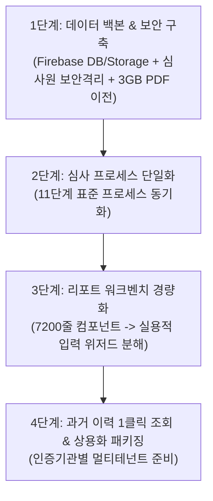

# GMSCS 앱 구조 및 프로세스 점검 보고서 & 로드맵

> **문서 위치**: `c:\myApp\GMSCS\docs\audit_app_review_report.md`  
> **목적**: 심사 프로세스 일관성, 보안(심사원 간 데이터 격리), 실용적 UI 경량화, Firebase 및 클라우드 스토리지 이전 로드맵 기준 문서

---

## 1. 현재 구조 점검 결과 (핵심 문제점 요약)

1. **심사 단계(프로세스)의 파편화**
   - DB 모델(`AuditStatus`: 11단계), 심사원 포털(`AuditLifecycleState`: 5단계), 사무국 포털(`CompanyAuditState`: 5단계)이 각각 따로 놀고 있음.
   - 단일 상태 머신(Single Source of Truth)으로 통합 필요.

2. **과도한 기능 및 비대한 UI (Over-engineering)**
   - `AuditReportWorkbench.tsx`가 7,200줄에 달하며, 오프라인 PDF 20장 실물을 웹 팝업 모달에 1:1로 복제하려다 보니 유지보수가 불가능할 정도로 무거워짐.
   - 현장 심사원에게 필요한 것은 가볍고 빠른 **단계별 입력 위저드(Step-by-step Wizard)**와 **최종 자동 PDF 렌더링/다운로드** 기능임.

3. **심사원 간 데이터 보안 격리 취약 (긴급)**
   - 현재 프론트엔드 브라우저(`App.tsx`)에서 모든 데이터를 내려받은 후 JS `filter()`로 가리고 있음.
   - 브라우저 개발자 도구를 열면 다른 심사원의 기업 및 심사 데이터를 모두 볼 수 있으므로, **Firebase Firestore Security Rules 기반 서버 단 격리**가 필수.

4. **데이터 저장 안정성 및 스토리지 분산**
   - `localStorage`와 Mock 데이터 혼용으로 브라우저 초기화 시 데이터 유실 위험.
   - 구글 드라이브에 분산된 과거 심사보고서 PDF(약 3GB)의 통합 관리 필요.

---

## 2. 구글 드라이브 PDF -> 파이어베이스 스토리지 이전 타당성 검토

### 💡 결론: **파이어베이스 스토리지(Firebase Storage) 이전이 압도적으로 유리하며 필수적입니다.**

* **비용 측면**: 3GB는 클라우드 기준 매우 작은 용량입니다. (Firebase 무료 제공량 5GB 내외, 유료 플랜 전환 시에도 3GB는 월 100원 미만 수준).
* **보안 및 권한 제어**: 구글 드라이브 링크는 심사원/고객별 권한 분리가 어렵고 보안 사고 위험이 큼. Firebase Storage Rules를 쓰면 "해당 심사원 및 사무국 관리자"만 토큰을 통해 안전하게 다운로드/조회 가능.
* **상용화(B2B 판매/SaaS) 필수 요건**: 타 인증기관에 솔루션을 판매할 때, 외부 구글 드라이브 인증을 요구하면 전문성이 떨어져 보이고 납품이 불가함. 앱 자체 저장소에 완벽히 통합되어야 함.
* **앱 내 뷰어 연동**: 앱 내 `PdfViewerModal`에서 딜레이/권한오류 없이 바로 로딩 가능.

---

## 3. 추천 개발 개선 순서 (4단계 로드맵)

### [1단계] 데이터 백본 & 보안 아키텍처 구축 (최우선)
1. Firestore DB 컬렉션 구조 정립 (`auditors`, `companies`, `audit_projects`, `audit_reports`, `contracts`).
2. Firestore Security Rules & Storage Rules 적용 (심사원은 본인 배정 건만 CRUD).
3. 구글 드라이브의 3GB PDF 파일들을 Firebase Storage로 일괄 업로드 및 메타데이터 연결 스크립트 실행.
4. `localStorage` 임시 저장 방식 완전히 제거.

### [2단계] 심사 프로세스 및 상태 머신(Status Machine) 단일화
1. 표준 인증 심사 주기 정의 (계약/일정협의 -> 계획서승인/발송 -> 현장심사 -> 보고서작성/서명 -> 사무국검토/보완 -> 심의의결 -> 인증서발행).
2. 사무국 포털과 심사원 포털이 동일한 `status`를 기준으로 화면을 렌더링하도록 일원화.

### [3단계] 비대한 UI 경량화 및 실용적 워크플로우 개편
1. 7,200줄의 `AuditReportWorkbench.tsx`를 기능별 컴포넌트로 모듈화.
2. 심사 현장에서 모바일/태블릿으로도 빠르게 작성할 수 있는 **스텝별 입력 폼** 제공.
3. PDF는 데이터 저장 후 필요 시 원클릭으로 백엔드/엔진에서 깔끔하게 출력(Export)하는 구조로 분리.

### [4단계] 과거 이력 열람 최적화 및 타 인증기관 판매(상용화) 준비
1. 회사별 과거 3년~10년 심사 이력 및 PDF 보고서를 연도별/차수별로 즉시 열람하는 아카이브 뷰.
2. 기관 로고, 규격, 비용 산정식을 설정 파일로 관리할 수 있는 멀티테넌트(Multi-tenant) 구조 완성.
