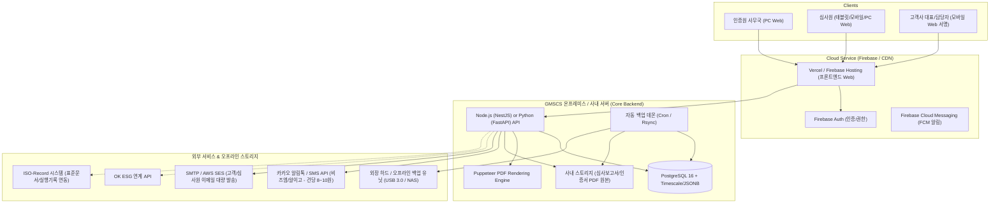
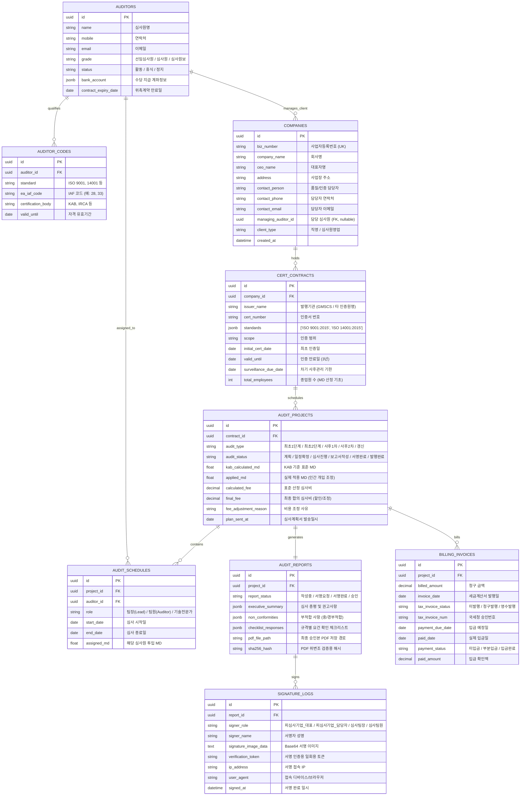
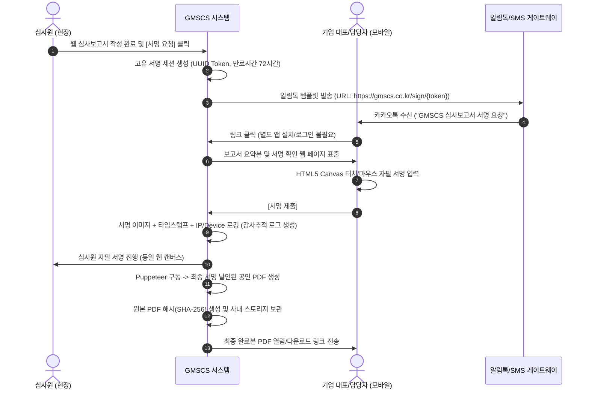

# [기획/설계] GMSCS 차세대 인증관리 플랫폼 구축 계획 및 아키텍처 설계서

본 문서는 ISO 인증기관 **GMSCS**의 고유 업무 프로세스, 300여 고객사 및 위촉/직영 심사원 운영체계, 웹 기반 심사보고서 및 무설치 전자서명, KAB 심사 MD/비용 조정, 하이브리드 인프라(Firebase + 사내 서버), 외장 백업, 그리고 향후 **OK ESG** 및 **ISO-Record** 연계까지 고려한 종합 구축 설계서입니다.

---

## 1. 기술 스택 및 하이브리드 인프라 아키텍처

인증기관의 특성(엄격한 감사 추적, 개인정보/계약정보 보호, 대용량 PDF 문서 보관)과 실시간성(모바일 서명 알림, 대시보드 캘린더)을 모두 만족하기 위해 **하이브리드 아키텍처**를 제안합니다.



### 권장 기술 스택 요약
| 영역 | 추천 기술 | 선정 사유 |
| :--- | :--- | :--- |
| **Frontend** | **Next.js (React) + TypeScript + Tailwind CSS** | 반응형 모바일 서명 패드, 직관적인 대시보드 캘린더(FullCalendar), SEO 및 빠른 로딩 지원 |
| **Backend API** | **Node.js (NestJS)** 또는 **FastAPI (Python)** | 모듈형 아키텍처, KAB MD 계산 엔진, PDF 대량 렌더링 비동기 큐(BullMQ) 지원 |
| **Database** | **PostgreSQL 16** (사내 서버) | 인증 데이터의 무결성(ACID), 복합 심사 규격/체크리스트의 유연한 저장을 위한 `JSONB` 지원, 완벽한 백업 지원 |
| **실시간/인증** | **Firebase Auth & Firestore (캐시/알림)** | 간편 로그인, 토큰 관리, 실시간 알림 피드, 외부 서명 세션 임시 동기화 |
| **보고서 PDF화** | **Puppeteer (Chromium Headless)** | 웹으로 작성된 HTML/CSS 보고서를 정부/인정기관 제출 규격에 맞춘 1:1 완벽한 벡터 PDF로 자동 변환 |
| **알림/메시징** | **카카오 알림톡(건당 7~8원) + LMS Fallback + 자체 메일** | 전자서명 링크 전송 비용 최소화 (문자 LMS 건당 25원 대비 알림톡은 1/3 수준) |

---

## 2. 데이터베이스(DB) 핵심 모델링 구조

인증기관의 복합 규격(ISO 9001/14001/45001 등 동시 심사), KAB MD 규칙, 심사원 배정, 타 인증원 명의 발행, 수납/계산서 상태를 망라한 RDB 설계입니다.



---

## 3. 웹 기반 심사보고서 & 모바일 원클릭 전자서명 체계

워드 기반에서 웹으로 전환할 때 가장 중요한 것은 **심사 현장에서의 입력 편의성**과 **외부 확인 서명의 법적/규정적 효력**입니다.

### 3.1 보고서 작성 및 변환 워크플로우
1. **규격별 템플릿 로딩**: ISO 9001/14001 등 심사 규격을 선택하면 해당 인정기구 표준 체크리스트 자동 로딩.
2. **현장 모바일/노트북 웹 작성**:
   - 오프라인/불안정 네트워크 지원: LocalStorage 자동 임시저장(1분 주기).
   - 사진 첨부: 심사 현장 증빙 사진을 웹에서 바로 업로드/압축.
3. **Puppeteer 기반 1:1 표준 서식 PDF 변환**:
   - 웹 화면의 서식 그대로 KAB/인증기관 공식 헤더/푸터, 페이지 번호가 포함된 고화질 PDF로 백그라운드 렌더링.

### 3.2 기업/심사원 무설치 전자서명 프로세스 (저비용 & 고편의성)


- **비용 최적화**: 
  - 1차: 카카오 알림톡 (건당 약 7~8원)
  - 2차: 카카오톡 미설치자/수신거부자 발생 시 SMS/LMS로 자동 전환 (Fallback)
  - 이메일: 무료/초저비용(사내 메일 서버 또는 SES)으로 동시 발송

---

## 4. 인증기관 특화 비즈니스 로직 설계

### 4.1 KAB 심사 MD 공식 엔진 & 수동 조정 (Override) 기능
- **표준 MD 산정 로직**:
  - 기업 종업원 수(FTE) 구간별 기본 MD 계산
  - 비즈니스 위험도(High/Medium/Low)에 따른 가감
  - 통합심사(ISO 9001 + 14001 등 복합 규격) 할인율 적용 (통상 20~30% 감면)
  - 심사 종류별 비율: 최초 1단계(전체 MD의 20~30%), 최초 2단계(70~80%), 사후심사(매년 1/3 MD), 갱신심사(2/3 MD)
- **인간 개입(Human-in-the-loop) 비용 조정**:
  - 시스템이 산출한 `표준 MD`와 `표준 견적가`를 기본 표시하되,
  - 관리자가 **[실제 적용 MD]**, **[조정 심사비]**, **[할인/추가 사유]**를 입력할 수 있는 필드 제공.
  - 이를 통해 감사(Audit) 시 KAB 규정 준수 여부를 입증하면서도 실제 영업 현실을 100% 반영.

### 4.2 타 인증원 명의 발행(Co-Certification / Multi-Issuer) 지원
- 계약(Contract) 및 프로젝트 등록 시 `발행 인증기관(Issuer)` 필드 선택:
  - 기본값: `GMSCS`
  - 기타: 협약된 타 인증원(예: 해외 인증원, 제휴 인정기관 등)
- 선택된 인증원에 따라 **인증서 양식, 로고, 보고서 표준 서식, KAB/IAF 인정마크**가 동적으로 치환되어 출력.

---

## 5. 대시보드 캘린더 & 사후관리 일정 관리

인증원 관리자 및 심사원이 로그인했을 때 가장 먼저 보는 메인 화면입니다.

### 5.1 종합 인터랙티브 캘린더 (FullCalendar 기반)
- **멀티 필터 컨트롤러**:
  - [일정별]: 월간(Month) / 주간(Week) / 일간(Day) / 간트차트(Timeline)
  - [심사원별]: 특정 심사원 필터 또는 심사원 간 스케줄 중복(Conflict) 체크
  - [고객사별]: 고객사 검색 및 해당 고객사의 전체 이력
  - [규격별]: ISO 9001, 14001, 45001 등 색상(Color-coded) 구분 태그
  - [심사코드별]: IAF 28(건설), 33(IT) 등 코드별 배정 가능 심사원 매칭 뷰
  - [진행상태별]: 계획수립 / 계획서발송완료 / 심사진행중 / 서명대기 / 계산서미발행 / 미입금

### 5.2 사후관리 심사 및 인증서 만료 자동 알림 엔진 (Cron Scheduler)
- **사후관리 주기 계산**:
  - 최초 2단계 인증 결정일 기준 12개월 이내에 1차 사후심사 완료 필수.
- **다단계 자동 알림 트리거**:
  - **D-90**: 고객사 및 담당 심사원에게 차기 사후관리 예정 안내 (이메일/알림톡)
  - **D-60**: 심사 일정 조율 요청 및 심사계획서 초안 생성 유도
  - **D-30**: 심사 미확정 시 인증원 사무국 대시보드에 긴급 경고(Red Badge) 노출
  - **만료 D-180**: 3년 만기 갱신심사(Recertification) 준비 알림

---

## 6. 서버 운영 및 2중 백업(외장 하드/오프라인 저장소) 자동화 전략

인증원의 심사 기록은 KAB 및 법적 요구사항에 따라 **최소 6년~10년 이상 무결하게 보존**되어야 합니다.

```mermaid
graph LR
    subgraph "사내 주 서버"
        DB_Live[(PostgreSQL DB)]
        File_Live[심사보고서/PDF 스토리지]
    end

    subgraph "1차 백업 (사내 서버 로컬 / NAS)"
        DB_Dump[일일 SQL Dump (.sql.gz)]
        File_Archive[PDF 일일 증분 백업]
    end

    subgraph "2차 백업 (외장 스토리지 유닛)"
        External_Drive["외장 하드 디스크 (USB 3.0 Auto-Mount)"]
        NAS_Cold["오프라인/보관용 콜드 스토리지"]
    end

    DB_Live -->|매일 02:00 pg_dump| DB_Dump
    File_Live -->|매일 03:00 rsync| File_Archive

    DB_Dump -->|백업 스크립트 실행| External_Drive
    File_Archive -->|백업 스크립트 실행| External_Drive
    External_Drive -.->|주기적 교체/보관| NAS_Cold
```

### 백업 자동화 구현 방안
1. **일일 자동 백업 스크립트 (Node.js / Bash Daemon)**:
   - 매일 심야(02:00) `pg_dump`로 암호화된 압축 DB 덤프 생성.
   - 신규 생성된 PDF 심사보고서 및 서명 증빙 파일을 증분 백업(Rsync).
2. **외장 하드 디스크 자동 감지 및 미러링**:
   - 서버에 마운트된 외장 드라이브(예: `/mnt/external_backup` 또는 Windows `D:\Backup_Disk`)를 자동 감지.
   - 백업 완료 후 관리자에게 이메일/텔레그램으로 "백업 성공 (용량: XX GB, 외장하드 잔여: YY GB)" 보고.
   - 외장 하드가 분리되어 있거나 용량 부족 시 즉각 관리자 알림.

---

## 7. 미래 확장: OK ESG & ISO-Record 연동 아키텍처

### 7.1 ISO 17021 독립성 원칙 준수 (컨설팅과 인증의 이해충돌 방지)
- **원칙**: ISO 인증기관은 피인증 고객사에게 컨설팅을 제공할 수 없습니다.
- **ISO-Record의 성격**:
  - 컨설팅이 아닌 **"고객 자율형 표준 양식 및 실행기록 저장고"**로 위치 부여.
  - 시스템 내 안내 문구 및 약관에 "본 표준 문서는 참고용이며, 기업 스스로 조직 상황에 맞게 수립·운영해야 함"을 명시하여 KAB 심사 시 지적 사항 원천 차단.

### 7.2 시스템 간 연계 방식
- **통합 식별자**: **사업자등록번호 (Business Registration Number)**
- **SSO (Single Sign-On)**:
  - Firebase Auth의 Custom Token 또는 OAuth2를 활용하여 GMSCS 계정으로 OK ESG 및 ISO-Record 단일 로그인 지원.
- **심사 시 기록 연동 (One-Click Verification)**:
  - 심사원이 GMSCS 웹 심사보고서를 작성할 때, 고객사가 ISO-Record에 등록한 프로세스 매뉴얼/기록 및 OK ESG 데이터의 공개 승인된 스냅샷을 팝업으로 즉시 대조 열람할 수 있도록 API 연동.

---

## 8. 단계별 개발 로드맵 (Execution Plan)

| 단계 | 기간(예상) | 핵심 산출물 및 구현 목표 |
| :--- | :--- | :--- |
| **Phase 1: 기초 설계 & 사내 인프라 구축** | 2주 | PostgreSQL DB 스키마 구축, 사내 서버 API 기본 뼈대, Firebase Auth 연동 |
| **Phase 2: 고객사/심사원/계약 관리 & KAB MD 엔진** | 3주 | 300여 기존 고객사 데이터 마이그레이션 도구, KAB MD 계산 및 수동 조정 기능, 발행기관(GMSCS/타원) 설정 |
| **Phase 3: 대시보드 캘린더 & 사후관리 스케줄러** | 2주 | 월간/주간/심사원별 인터랙티브 캘린더, D-90/60/30 사후관리 자동 알림 엔진 |
| **Phase 4: 웹 심사보고서 & 모바일 전자서명** | 4주 | 규격별 웹 체크리스트/보고서 폼, 카카오 알림톡 무설치 터치 서명, Puppeteer PDF 자동 생성 |
| **Phase 5: 수납/세금계산서, 백업 데몬 & 게시판** | 2주 | 입금/계산서 상태 추적, 외장하드 자동 백업 스크립트, 공지사항/자료실, 메일 발송기 |
| **Phase 6: OK ESG 및 ISO-Record 연계** | 2주 | 사업자번호 기반 SSO 연동, 실행기록 열람 뷰어 연동 |
| **합계** | **약 15주** | 현장 테스트 및 KAB 심사 대비 검증 완료 후 정식 오픈 |

---

## 9. 사용자 검토 및 확인 요청 (Open Questions)

> [!IMPORTANT]
> 본 개발 계획에 착수하기 전, 다음 항목들에 대한 고객님의 확인이 필요합니다:
> 
> 1. **기존 데이터 마이그레이션**: 현재 외주 개발된 프로그램에서 고객사 300여 곳의 정보(사업자번호, 대표자, 인증이력 등)를 엑셀(Excel)이나 DB 덤프로 추출할 수 있는지 여부
> 2. **사내 서버의 사양 및 운영체제**: 현재 인증원에 보유 중인 서버가 Windows Server인지, 리눅스(Ubuntu 등)인지, 사내 고정 IP(공인 IP) 및 도메인이 연결되어 있는지 여부
> 3. **서명 수신 알림 채널 선호도**: 심사 기업 서명 요청 시 **카카오 알림톡(비즈엠 등 사업자 등록 필요)**을 선호하시는지, 아니면 초기에는 **이메일 + 일반 SMS/LMS**로 먼저 시작하시는지 여부
