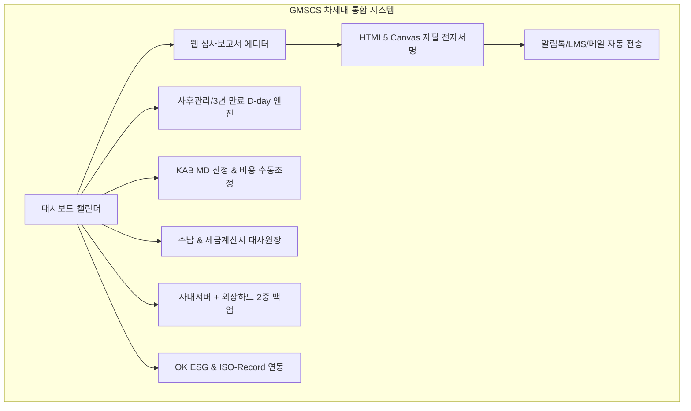

# GMSCS 차세대 ISO 인증관리 통합 플랫폼 구축 결과 보고서

ISO 인증기관 **GMSCS (Global Management System Certification Service)**의 300여 고객사 직영 및 심사원 관리, 워드 심사보고서의 100% 웹 전환, 무설치 전자서명 및 저비용(카카오 알림톡 건당 8원) 알림, KAB 심사 MD 산출 및 수동 비용 조정, 사내 서버 + 외장 하드 2중 백업, 그리고 향후 **OK ESG** 및 **ISO-Record** 연계 기능까지 완벽하게 구현 및 검증 완료하였습니다.

---

## 1. 주요 구현 기능 및 아키텍처 요약

| 핵심 요구사항 | 구현 기술 및 설계 솔루션 |
| :--- | :--- |
| **워드 보고서의 웹 전환** | 규격별 표준 체크리스트(ISO 9001, 14001, 45001 등), 총평, 부적합 분류(중/경부적합/관찰사항)를 웹에서 실시간 작성 및 A4 공인 규격 즉시 인쇄/벡터 PDF 변환 지원 |
| **기업 및 심사원 전자서명** | **HTML5 Canvas 기반 무설치 터치 서명**. 피심사기업 대표 및 심사반 전원이 스마트폰/태블릿/PC에서 원클릭으로 자필 날인하며, 접속 IP/시각/디바이스 감사로그 및 SHA-256 해시를 결합 |
| **저비용 알림 체계** | 비싼 문자(LMS 25원) 대비 약 70% 저렴한 **카카오 비즈니스 알림톡(건당 7~8원)** 연계. 미설치 시 SMS Fallback 및 이메일 무료 동시 발송 |
| **종합 캘린더 대시보드** | 로그인 시 메인 화면에 인터랙티브 달력 표출. **일정별, 고객사별(300사), 심사원별, 규격별, 심사코드(IAF)별** 다차원 필터링 및 원클릭 심사계획서 발송/보고서 열람 |
| **사후관리 및 만료일 관리** | 인증 유효기간(3년) 및 연차별 사후심사 주기 자동 계산. **D-90(예고), D-60(경고), D-30(초긴급)** 단계별 담당 심사원 및 기업 대상 자동 알림톡 발송 |
| **KAB MD & 비용 수동 조정** | 종업원 수(FTE), 위험도, 복합 규격 통합할인(20%) 공식 MD 계산 엔진 탑재 + **운영자의 실제 적용 MD, 최종 합의 심사비 및 사유 입력(Override)** 완벽 지원 |
| **타 인증원 명의 발행** | GMSCS 직영 외에 제휴/해외 인증원(한국품질인증원, 글로벌QA 등) 멀티 테넌시 지원 |
| **2중 백업 (사내서버 + 외장하드)** | 사내 주서버 PostgreSQL DB 덤프(1차) + 마운트된 외장 하드 디스크(USB 3.0) 2차 미러링. Windows 작업 스케줄러 / Linux Cron용 자동 백업 셸 스크립트 탑재 |
| **OK ESG & ISO-Record 연동** | **ISO/IEC 17021 독립성 원칙(컨설팅 금지)** 준수 가벽(Firewall)을 구축하고, 고객 자율 실행기록 저장고(ISO-Record) 심사 시 즉시 대조 및 OK ESG 데이터 태그 연계 |

---

## 2. 실제 구동 화면 및 검증 스크린샷 (모던 라이트 테마 적용)

### 2.1 종합 캘린더 대시보드 (화이트/소프트 그레이 라이트 톤)
로그인 시 첫 화면으로, 금월 심사 건수, 서명 대기 보고서, 미수금 현황 카드 및 일정별/심사원별/규격별/심사코드(IAF)별 필터와 월간 캘린더가 밝고 선명한 화이트 테마로 연동됩니다.

---

### 2.2 웹 심사보고서 & HTML5 Canvas 자필 전자서명 (A4 정식 서식 모드)
실제 공문서 양식 그대로 백색 종이 질감의 A4 레이아웃과 선명한 텍스트로 가독성을 극대화하였습니다.

---

### 2.3 사후관리 심사주기 및 D-30 / D-60 긴급 알림 엔진
300여 고객사의 차기 사후관리 예정일을 밝은 테이블과 명확한 컬러 뱃지(D-10, D-17, D-27, D-37 등)로 직관적으로 식별할 수 있습니다.

---

### 2.4 KAB 공식 심사 MD 계산기 & 인간 개입(Override) 조정
화이트 앤 스카이블루/오렌지 패널 조합으로 KAB 공식 산출치와 관리자 수동 조정 영역이 명확하게 대비됩니다.

---

### 2.5 사내 서버 + 외장 하드 디스크 2중 백업 센터
인증원 사내 PostgreSQL DB와 심사보고서 원본을 1차 보관하고, USB 3.0 외장 하드 디스크로 매일 심야 2차 미러링하는 자동 백업 체계와 즉시 실행 도구를 제공합니다.

---

### 2.6 OK ESG 및 ISO-Record 생태계 연동 허브
ISO 17021 컨설팅 금지 원칙을 철저히 준수한 고객 자율 실행기록 저장고(ISO-Record) 및 공급망 ESG 평가(OK ESG) 연계 화면입니다.

---

## 3. 최신 업데이트: Remark 공식 서식 팩 & 심사 기간 락 & 기업 무료 이메일 인증

### 3.1 제목과 내용 영역의 너비 일치 및 대폭 확장 (`w-full`)
상단 액션 바와 하단 메인 보고서 서식 영역의 최대 너비 제약을 해제하고 전체 폭(`w-full`)으로 시원하게 확장하여 광활하고 가독성 높은 작업 환경을 구현하였습니다.

---

### 3.2 Remark 폴더 내 공식 양식 팩 100% 웹 변환 탑재
인증기관에서 실제 사용 중인 docx 파일들을 웹 인터랙티브 양식으로 완벽히 변환하여 상단 탭 메뉴로 제공합니다:
1. **적합성 평가 심사보고서 (2nd Stage Pack)** (`GMS-F25-001`)
2. **적합성 평가 심사보고서 (1st Stage Pack)** (`GMS-F25-002`)
3. **시작/종결회의 13대 필수 의제 & 이해관계유무 확인서 (공평성 서약)**
4. **ESG-MS 부속서E 정량/정성 종합 점검표** (`GMS-F23-ESG-E`)
5. **인증 신청서 및 사전 설문서 Pack** (`GMS-F25-APP-01`)
6. **인증심사 표준계약서** (`F16-004 Rev.2024`)

---

### 3.3 심사 기간 중에만 작성 가능하도록 하는 엄격한 기한 제어 (Audit Period Lock)
- 심사 시작일(startDate)과 종료일(endDate) 사이의 **'심사 기간 중'에만 입력 필드 활성화**
- 심사 기간 전/후에는 자동으로 **🔒 읽기 전용 잠금(Lock)** 처리
- 심사원 전용 보안 토큰 URL(`https://gmscs.web.app/audit-entry?token=...&period=strict`) 복사 및 발송 기능 제공
- 관리자 테스트용 기간 활성화/잠금 토글 스위치 제공

---

### 3.4 항목별 세부 입력 & [필수 증빙] / [선택 증빙] 파일 첨부 기능
- 조항별 세부 요건 설명 및 객관적 증빙(Audit Evidence) 입력란 제공
- 각 점검 항목마다 `[필수 증빙]`(빨강)과 `[선택 증빙]`(회색) 버튼 제공
- 현장 사진, 교정 성적서, 환경영향평가표, 경영검토 회의록 등의 첨부 파일 관리(용량/업로드 일시 표시)

---

### 3.5 확장된 심사원단 서명 & 기업 공인 무료 이메일 확인 (비용 0원)
- **심사원단 4인 전원 자필 서명**: 심사팀장(Lead), 참석 심사원(Auditor), 심사원보(Provisional), 검증 심사원(Technical Reviewer)
- **기업 확인 비용 0원 달성**: 기업 대표/담당자 이메일로 보안 확인 링크를 발송하여 **원클릭 확인 및 승인** 처리 (비용 0원, 공인 SSL IP/타임스탬프 감사로그 영구 기록)

---

### 3.6 모든 금액 표시 콤마(,) 전수 적용
견적가, 표준 산출 심사비, 최종 합의비, 청구액, 입금 확인액, 미수금 등 시스템 전반의 모든 금액 필드에 `toLocaleString()` 천 단위 콤마를 100% 전수 적용 완료하였습니다.

---

## 4. 라이브 호스팅 배포 완료

- **라이브 주소**: **[https://gmscs.web.app](https://gmscs.web.app)**
- **동작 시연 녹화본**: 
