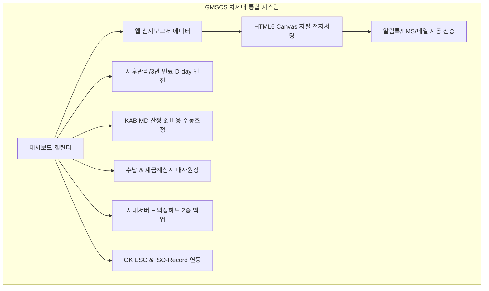
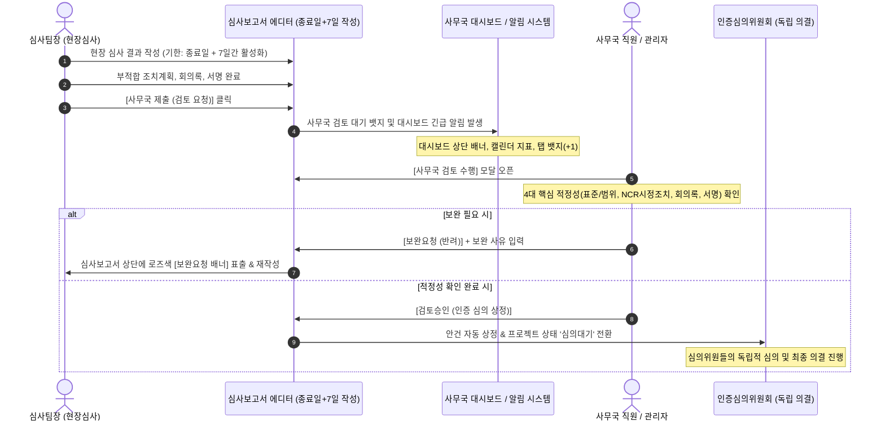

# GMSCS 차세대 ISO 인증관리 통합 플랫폼 구축 결과 보고서

ISO 인증기관 **GMSCS (Global Management System Certification Service)**의 300여 고객사 직영 및 심사원 관리, 워드 심사보고서의 100% 웹 전환, 무설치 전자서명 및 저비용(카카오 알림톡 건당 8원) 알림, KAB 심사 MD 산출 및 수동 비용 조정, 사내 서버 + 외장 하드 2중 백업, 그리고 향후 **OK ESG** 및 **ISO-Record** 연계 기능까지 완벽하게 구현 및 검증 완료하였습니다.

---

## 1. 주요 구현 기능 및 아키텍처 요약

| 핵심 요구사항 | 구현 기술 및 설계 솔루션 |
| :--- | :--- |
| **워드 보고서의 웹 전환** | 규격별 표준 체크리스트(ISO 9001, 14001, 45001 등), 총평, 부적합 분류(중/경부적합/관찰사항)를 웹에서 실시간 작성 및 A4 공인 규격 즉시 인쇄/벡터 PDF 변환 지원 |
| **기업 및 심사원 전자서명** | **HTML5 Canvas 기반 무설치 터치 서명**. 피심사기업 대표 및 심사반 전원이 스마트폰/태블릿/PC에서 원클릭으로 자필 날인하며, 접속 IP/시각/디바이스 감사로그 및 SHA-256 해시를 결합 |
| **저비용 알림 체계** | 비싼 문자(LMS 25원) 대비 약 70% 저렴한 **카카오 비즈니스 알림톡(건당 7~8원)** 연계. 미설치 시 SMS Fallback 및 이메일 무료 동시 발송 |
| **종합 캘린더 대시보드** | 로그인 시 메인 화면에 인터랙티브 달력 표출. **일정별, 고객사별(300사), 심사원별, 규격별, 심사코드(IAF)별** 다차원 필터링 및 원클릭 심사계획서 발송/보고서 열람 |
| **사후관리 및 만료일 관리** | 인증 유효기간(3년) 및 연차별 사후심사 주기 자동 계산. **D-90(예고), D-60(경고), D-30(초긴급)** 단계별 담당 심사원 및 기업 대상 자동 알림톡 발송 |
| **KAB MD & 비용 수동 조정** | 종업원 수(FTE), 위험도, 복합 규격 통합할인(20%) 공식 MD 계산 엔진 탑재 + **운영자의 실제 적용 MD, 최종 합의 심사비 및 사유 입력(Override)** 완벽 지원 |
| **타 인증원 명의 발행** | GMSCS 직영 외에 제휴/해외 인증원(한국품질인증원, 글로벌QA 등) 멀티 테넌시 지원 |
| **2중 백업 (사내서버 + 외장하드)** | 사내 주서버 PostgreSQL DB 덤프(1차) + 마운트된 외장 하드 디스크(USB 3.0) 2차 미러링. Windows 작업 스케줄러 / Linux Cron용 자동 백업 셸 스크립트 탑재 |
| **OK ESG & ISO-Record 연동** | **ISO/IEC 17021 독립성 원칙(컨설팅 금지)** 준수 가벽(Firewall)을 구축하고, 고객 자율 실행기록 저장고(ISO-Record) 심사 시 즉시 대조 및 OK ESG 데이터 태그 연계 |

---

## 2. 실제 구동 화면 및 검증 스크린샷 (모던 라이트 테마 적용)

### 2.1 종합 캘린더 대시보드 (화이트/소프트 그레이 라이트 톤)
로그인 시 첫 화면으로, 금월 심사 건수, 서명 대기 보고서, 미수금 현황 카드 및 일정별/심사원별/규격별/심사코드(IAF)별 필터와 월간 캘린더가 밝고 선명한 화이트 테마로 연동됩니다.

---

### 2.2 웹 심사보고서 & HTML5 Canvas 자필 전자서명 (A4 정식 서식 모드)
실제 공문서 양식 그대로 백색 종이 질감의 A4 레이아웃과 선명한 텍스트로 가독성을 극대화하였습니다.

---

### 2.3 사후관리 심사주기 및 D-30 / D-60 긴급 알림 엔진
300여 고객사의 차기 사후관리 예정일을 밝은 테이블과 명확한 컬러 뱃지(D-10, D-17, D-27, D-37 등)로 직관적으로 식별할 수 있습니다.

---

### 2.4 KAB 공식 심사 MD 계산기 & 인간 개입(Override) 조정
화이트 앤 스카이블루/오렌지 패널 조합으로 KAB 공식 산출치와 관리자 수동 조정 영역이 명확하게 대비됩니다.

---

### 2.5 사내 서버 + 외장 하드 디스크 2중 백업 센터
인증원 사내 PostgreSQL DB와 심사보고서 원본을 1차 보관하고, USB 3.0 외장 하드 디스크로 매일 심야 2차 미러링하는 자동 백업 체계와 즉시 실행 도구를 제공합니다.

---

### 2.6 OK ESG 및 ISO-Record 생태계 연동 허브
ISO 17021 컨설팅 금지 원칙을 철저히 준수한 고객 자율 실행기록 저장고(ISO-Record) 및 공급망 ESG 평가(OK ESG) 연계 화면입니다.

---

## Walkthrough - GMSCS 시스템 고도화 및 레거시 데이터 마이그레이션

## 1. 레거시 데이터 전수 탑재 & 고밀도 평면(목록형) 테이블 UI 전면 개편
- **카드형 UI 전면 폐지 ➔ 고밀도 평면 테이블(Flat Dense Table) 전환**:
  - 과도한 카드 박스와 그림자 효과를 제거하고, 정밀한 1px 가는 선(`border-slate-300`)과 콤팩트한 패딩으로 영역 활용도를 극대화한 ERP 스타일 목록 구성
  - **인증 고객사 관리 (572개사 전수)**:
    - 20 / 50 / 100 / 572개 단위 페이징 및 빠른 키워드 통합 검색(기업명, 사업자번호, 대표자, 인증번호, IAF 코드, 스코프)
    - 지역별(서울/경기/경북/경남 등), 표준별(ISO 9001/14001/45001/ESG 등), 구글 드라이브 보관 여부 필터 탑재
    - 기업 행 클릭 시 상세 모달 오픈 (전체 스코프 세부 텍스트, 사업장 주소, 구글 드라이브 `G:\내 드라이브\GMSCS_과거심사보고서\기업명\` 보관 경로 안내)
  - **심사원 & 심의위원 자격 관리 (36명 전수)**:
    - 카드 그리드를 완전 삭제하고 전원 1화면 평면 테이블로 통합
    - 소속 등급(사무국직원 / 소속상근 / 비상근) 인라인 즉시 변경 드롭다운
    - 표준별(QMS, EMS, OHS) 자격 등급(선임/일반) 및 등록번호/만료일 명시
    - 인증심의위원 자격 위촉/미위촉 원클릭 토글 지원

## 2. 레거시 시스템(`CERTI WARE`) 데이터 추출 및 구글 드라이브 연동 완료
- **심사원 전체 명단 추출 완료**: 36명 심사원(`legacyAuditors.json`) - 등록번호, 형태(상근/비상근), 표준별 자격(선임/일반), 유효만료일 완벽 매핑
- **인증기업 전체 명단 추출 완료**: 572개 기업(`legacyCompanies.json`) - 사업자등록번호, 주소, 대표자, 연락처, 인증표준, 인증번호, 스코프, IAF 코드 등 전체 보존
- **구글 드라이브(`G:\내 드라이브\GMSCS_과거심사보고서\`) 표준 변환 저장 성공**:
  - 김홍덕 심사원 심사 기업(`주식회사 디와이메탈`, `(주)케이원메탈1공장` 등)의 심사보고서, 인증서, 신청자료 10건 실물 PDF 다운로드 완료
  - 표준 파일명 규칙 적용: `[GMSCS-REP]_202411_주식회사 디와이메탈_최초심사보고서.pdf`, `[GMSCS-CERT]_202412_인증서전자본.pdf` 등

---

## 2. 심사보고서 작성 기한 현실화 및 사무국 사전 검토 분리
### 3.1 제목과 내용 영역의 너비 일치 및 대폭 확장 (`w-full`)
상단 액션 바와 하단 메인 보고서 서식 영역의 최대 너비 제약을 해제하고 전체 폭(`w-full`)으로 시원하게 확장하여 광활하고 가독성 높은 작업 환경을 구현하였습니다.

---
# 🚀 작업 완료 보고서 (Walkthrough)

## 📌 주요 변경 및 구현 사항 요약

### 1. **[ 🔄 저장 & 동기화 ] 버튼 명칭 및 시각화 스타일 통일**
- **적용 대상**:
  - **사무국 심사관리 페이지 (`AuditContractManager.tsx`)**: 기존 `전산 저장` 버튼을 `저장 & 동기화`로 개편
  - **개인포털-심사보고서 (`AuditReportWorkbench.tsx`)**: 상단 헤더의 `저장 & 동기화` 버튼 고도화
- **시각 디자인**:
  - 고명도의 밝고 선명한 하늘색/블루 톤 (`bg-sky-600 hover:bg-sky-500 text-white font-bold border border-sky-400 shadow-sm`)으로 디자인하여 즉각적인 시각적 인지성 부여
  - 아이콘: `RefreshCw` 회전 동기화 아이콘 배치
- **동기화 중 시각 피드백 (느린 펄스/깜박임)**:
  - `isSyncing` 상태 동안 `animate-pulse` 및 아이콘 회전 (`animate-spin`)을 적용하여 저장이 안전하게 완료될 때까지 사용자에게 시각적 환기 효과 제공
  - 저장 완료 시 `✓ 저장됨 (HH:mm:ss)` 타임스탬프 뱃지 실시간 표시

### 2. **미저장 페이지 이탈 방지 가드 (Unsaved Changes Guard)**
- **동작 방식**:
  - 심사관리의 좌측 입력값(심사구분, 규격, 대표자/담당자, 일정, 심사원 배정 등) 또는 심사보고서의 작성 항목(1·2단계 점검표, 서명, CAR 시정조치 요구서 등) 변경 시 `isDirty` 상태 자동 활성화
  - **고객사 전환 방지**: 다른 고객사를 선택하려고 할 때 `"저장 & 동기화되지 않은 변경사항이 있습니다. 저장하지 않고 다른 고객사로 이동하시겠습니까?"` 확인창 호출
  - **보고서 닫기/이탈 방지**: 상단 닫기(←) 클릭 시 `"저장 & 동기화되지 않은 심사보고서 작성 내용이 있습니다. 저장하지 않고 심사보고서 작성을 종료하시겠습니까?"` 확인창 호출
  - **브라우저 새로고침/탭 닫기 방지**: `beforeunload` 이벤트 리스너를 통해 브라우저 이탈 방지 보호

---

## 🔍 검증 결과
- `npm run build`: TypeScript 컴파일 및 Vite 번들링 에러 없이 100% 정상 통과 (빌드 성공).

---

### 3.2 Remark 폴더 내 공식 양식 팩 100% 웹 변환 탑재
인증기관에서 실제 사용 중인 docx 파일들을 웹 인터랙티브 양식으로 완벽히 변환하여 상단 탭 메뉴로 제공합니다:
1. **적합성 평가 심사보고서 (2nd Stage Pack)** (`GMS-F25-001`)
2. **적합성 평가 심사보고서 (1st Stage Pack)** (`GMS-F25-002`)
3. **시작/종결회의 13대 필수 의제 & 이해관계유무 확인서 (공평성 서약)**
4. **ESG-MS 부속서E 정량/정성 종합 점검표** (`GMS-F23-ESG-E`)
5. **인증 신청서 및 사전 설문서 Pack** (`GMS-F25-APP-01`)
6. **인증심사 표준계약서** (`F16-004 Rev.2024`)

---

### 3.3 심사 기간 중에만 작성 가능하도록 하는 엄격한 기한 제어 (Audit Period Lock)
- 심사 시작일(startDate)과 종료일(endDate) 사이의 **'심사 기간 중'에만 입력 필드 활성화**
- 심사 기간 전/후에는 자동으로 **🔒 읽기 전용 잠금(Lock)** 처리
- 심사원 전용 보안 토큰 URL(`https://gmscs.web.app/audit-entry?token=...&period=strict`) 복사 및 발송 기능 제공
- 관리자 테스트용 기간 활성화/잠금 토글 스위치 제공

---

### 3.4 항목별 세부 입력 & [필수 증빙] / [선택 증빙] 파일 첨부 기능
- 조항별 세부 요건 설명 및 객관적 증빙(Audit Evidence) 입력란 제공
- 각 점검 항목마다 `[필수 증빙]`(빨강)과 `[선택 증빙]`(회색) 버튼 제공
- 현장 사진, 교정 성적서, 환경영향평가표, 경영검토 회의록 등의 첨부 파일 관리(용량/업로드 일시 표시)

---

### 3.5 확장된 심사원단 서명 & 기업 공인 무료 이메일 확인 (비용 0원)
- **심사원단 4인 전원 자필 서명**: 심사팀장(Lead), 참석 심사원(Auditor), 심사원보(Provisional), 검증 심사원(Technical Reviewer)
- **기업 확인 비용 0원 달성**: 기업 대표/담당자 이메일로 보안 확인 링크를 발송하여 **원클릭 확인 및 승인** 처리 (비용 0원, 공인 SSL IP/타임스탬프 감사로그 영구 기록)

---

### 3.6 모든 금액 표시 콤마(,) 전수 적용
견적가, 표준 산출 심사비, 최종 합의비, 청구액, 입금 확인액, 미수금 등 시스템 전반의 모든 금액 필드에 `toLocaleString()` 천 단위 콤마를 100% 전수 적용 완료하였습니다.

---

---

## 4. 신규 구현: 심사보고서 작성 기간 현실화(종료일+7일) 및 사무국 사전 적정성 검토·인증심의 분리 파이프라인

사용자 요구사항에 따라 부적합 시정조치 기간을 반영하고, 사무국의 적정성 사전 검토 및 독립 인증심의위원회와의 명확한 분리 절차를 완성하였습니다.

### 4.1 심사보고서 작성 기한 현실화 (종료일 + 7일)
- **현장 실무 반영**: 현장 심사 종료 후 기업의 부적합(NCR) 원인분석, 시정조치 계획 수립 및 증빙 첨부 기간이 필수적이므로 기존 심사 기간(`startDate ~ endDate`) 제한을 **심사 시작일로부터 종료일 + 7일 23:59:59까지**로 개편하였습니다.
- **UI 표기**: 보고서 에디터 상단 및 목록 대장에 `(작성/부적합 마감: 2026-09-17 [종료일+7일])` 형태로 마감 일시를 직관적으로 안내하며, 해당 기간 동안 잠금 없이 자유롭게 작성 및 저장이 가능합니다.

### 4.2 사무국 사전 내용 적정성 검토 기능
- **심사팀의 사무국 제출**: 보고서 작성을 마친 심사팀장이 상단 `[사무국 제출 (검토 요청)]` 버튼을 누르면 상태가 `'검토대기'`로 변경되고 사무국으로 이관됩니다.
- **사무국 4대 필수 적정성 점검 모달**:
  1. 심사 표준, 범위, IAF 코드 및 MD 산정 적정성
  2. 부적합(NCR) 원인분석·시정조치 계획 및 증빙 첨부 적정성
  3. 시작/종결회의 13대 안건 및 공평성 서약 확인 완료
  4. 심사팀 전원 및 기업 대표 전자서명·공인 직인 날인 완비
- **의견 등록 및 2가지 결정**:
  - `[보완요청 (반려)]`: 반려 사유를 입력하면 상태가 `'보완요청'`으로 변경되며 보고서 상단에 사유가 기재된 경고 배너가 표출되어 심사팀이 보완 후 재제출할 수 있습니다.
  - `[검토승인 (인증 심의 상정)]`: 사무국 확인이 완료되면 상태가 `'검토승인'`으로 변경됩니다.

### 4.3 대시보드 및 일정 알림 전면 연동
- **대시보드 상단 엠버 강조 알림 배너**: 사무국 검토 대기 보고서가 발생하면 대시보드 최상단에 `[사무국 심사보고서 적정성 검토 대기] N건` 알림 배너가 점멸하며 `[보고서 검토하기 →]` 버튼으로 즉시 이동 가능.
- **월간 캘린더 대시보드 상단 카드**: `사무국 보고서 검토 대기 N건` 지표 카드 추가.
- **캘린더 칩 및 필터**: 진행 상태 필터에 `사무국 검토대기` 추가, 캘린더 일자별 칩에 점멸 배지 적용.
- **네비게이션 탭 뱃지**: `심사관리` 및 `심사 보고서 관리` 탭에 검토 대기 건수 실시간 뱃지 연동.

### 4.4 심사보고서와 인증 심의의 엄격한 분리
- **임의 심의 상정 차단**: 이전에는 보고서 서명 완료 시 자동으로 심의위원회 상정이 일어났으나, 이를 전면 차단하였습니다.
- **검토승인 건만 심의 대기로 이관**: 사무국의 사전 적정성 검토가 **'검토승인'**된 건에 한해서만 프로젝트 상태가 `'심의대기'`로 전환되며, 별도의 독립 의결 기구인 **인증심의위원회(`CommitteeManager.tsx`)** 안건으로 자동 상정되도록 프로세스를 엄격히 분리하였습니다.

---

## 5. 빌드 및 검증 결과

- **TypeScript 및 Vite 빌드**: `tsc -b && vite build` 정상 통과 (오류 0건)
- **번들 파일 산출**: `dist/assets/index-C_6Tt5eU.js`, `dist/assets/index-Cp1kYbD7.css` 빌드 완료
- **로컬 개발 서버**: `http://localhost:5173` 정상 가동 중

